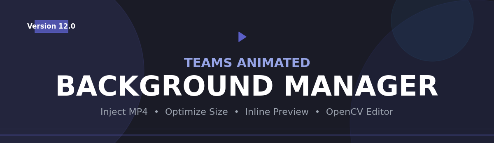
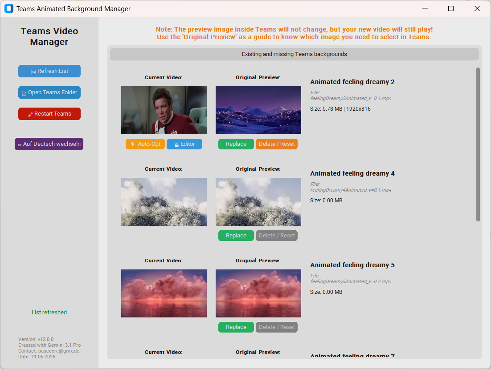
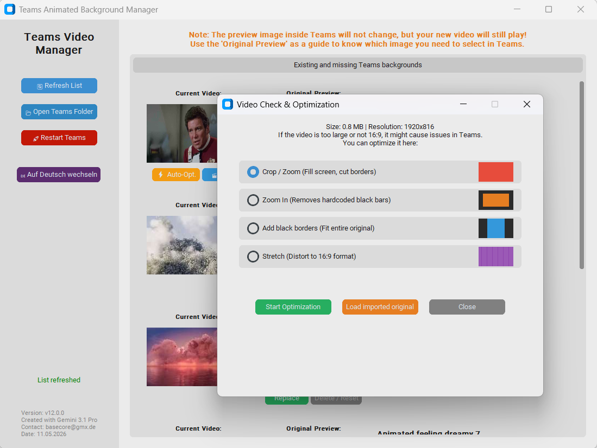

<p align="center">
  
</p>

# Teams Animated Background Manager 🎥✨

[](https://www.python.org/)
[](https://www.microsoft.com/windows/)
[](https://www.pyinstaller.org/)
[](https://opencv.org/)
[](https://github.com/basecore)

A local Windows desktop utility for managing, replacing, previewing, and optimizing animated Microsoft Teams backgrounds.

This application was created for users who want to inject custom MP4 video backgrounds into the **new Microsoft Teams** client, while keeping the process transparent, reversible, and easier to use than manually editing hidden cache folders.

<p align="center">
  
  &nbsp;&nbsp;&nbsp;
  
</p>

---

## Overview

Microsoft Teams includes several built-in animated backgrounds, but it does not currently provide an official UI for uploading custom MP4 animated backgrounds in the same way. This tool works locally by replacing the cached MP4 files used by selected built-in animated backgrounds.

The app helps with:
- finding the correct Teams background cache folder,
- previewing existing/custom videos,
- replacing default animated backgrounds with your own MP4 files,
- optimizing oversized files to reduce bandwidth and storage usage,
- restoring or resetting changes,
- restarting Teams so changes become active quickly.

> Important: the **thumbnail shown inside Microsoft Teams itself does not change**. Teams continues to display the original built-in preview image, even if the underlying video file was replaced.

---

## Main Features

### 🎬 Inline preview player
Click the current video thumbnail directly inside the app to play or stop the animation inline. No separate preview window is required.

### ⚡ Auto optimization
Large videos can be automatically reduced in size by lowering resolution and/or frame rate. The app avoids saving an optimized result if it would become larger than the original input file.

### 🛠 Video editor
Built-in OpenCV-based editing modes:
- Crop / Zoom
- Zoom In
- Add Black Borders / Pad
- Stretch to 16:9

### 🛡 Backup and reset workflow
The tool keeps local backup/reset logic so changes are reversible. “Delete / Reset” removes the custom MP4 so Teams can fall back to its original cached/default behavior.

### ⚠ File size warnings
Visual warnings help identify backgrounds that may be too large for practical use:
- Warning above medium size
- Critical warning above large size

### 🌍 Bilingual interface
German and English UI are supported.

### 🚀 Teams restart button
The tool can terminate and relaunch the Teams client to make changes visible faster.

---

## Tested Environment

This project has been tested with:

- **Operating System:** Windows 10 / Windows 11
- **Microsoft Teams Client:** New Microsoft Teams
- **Tested Teams version:** `26093.415.4620.1935`
- **Verification date:** May 11, 2026

Because Microsoft may change internal cache paths or file naming conventions in future Teams releases, compatibility with later builds cannot be guaranteed.

---

## Security / Trust Statement

This project is designed as a **local-only utility**. It is intended to be transparent and auditable, especially for use on work computers where trust matters.

### What the app does
- Reads files from the local Microsoft Teams animated background cache folder.
- Writes/replaces local MP4 files in that folder.
- Creates local backup or restore copies.
- Reads video metadata such as file size, resolution, and frames.
- Processes local video files with OpenCV.
- Optionally terminates and restarts the local Teams process.

### What the app does NOT do
- No custom backend server communication.
- No telemetry or analytics.
- No advertisement SDKs.
- No auto-update system.
- No scheduled tasks.
- No autorun registration.
- No registry persistence mechanism.
- No credential collection.
- No keyboard logging.
- No browser data access.
- No arbitrary remote code execution feature.

### Security-sensitive capabilities
The application **does** modify files under the local Teams cache path and **does** interact with the local Teams process. These are intentional features, but they are also the reason why internal IT or endpoint protection tools may want to inspect the binary before trusting it.

### Recommendation for enterprise use
For work computers, it is recommended to:
- review the Python source code,
- build the EXE internally if possible,
- publish a SHA256 checksum,
- run the file through VirusTotal,
- optionally have internal IT whitelist the binary or certificate.

---

## Is this app malware?

There is no intended malicious behavior in this project. However, like many internal utilities, it has capabilities that overlap with actions security software watches closely:
- local file replacement,
- process termination/restart,
- packaged Python runtime,
- media processing libraries.

That means security tools may still flag the EXE heuristically even if the source code is benign. This is especially common for unsigned executables packaged with PyInstaller, because PyInstaller bundles Python and dependencies and can extract them at runtime in some build modes [page:1][page:3].

This does **not automatically mean the app is dangerous**, but it does mean transparency is important.

---

## Python Modules Used

The application uses the following main libraries:

| Module | Purpose |
|---|---|
| `customtkinter` | Modern Windows-style GUI built on top of Tkinter |
| `Pillow` | Image loading, resizing, thumbnail handling, icon drawing |
| `opencv-python` (`cv2`) | Video reading, frame extraction, resizing, padding, cropping, encoding |
| `numpy` | Efficient image/frame array handling for OpenCV operations |
| `psutil` | Detecting, stopping, and restarting Teams-related processes |
| `pathlib` | Safe path construction for Windows folders |
| `shutil` | Copying, replacing, and deleting files |
| `threading` | Background operations to keep UI responsive |
| `base64`, `io` | Embedded preview image handling |
| `datetime`, `time`, `os`, `sys` | Standard Python runtime and file/process helpers |

### Why these modules are needed
- Without **OpenCV**, the app could not inspect, transform, preview, or optimize video files.
- Without **Pillow**, thumbnail and preview image handling would be harder.
- Without **psutil**, restarting Teams would be less robust.
- Without **customtkinter**, the interface would be much more basic.

---

## Local Paths Used

The app primarily targets this Teams cache location:

```text
%LOCALAPPDATA%\Packages\MSTeams_8wekyb3d8bbwe\LocalCache\Microsoft\MSTeams\Backgrounds
```

If Microsoft changes this path in future versions, the tool may need updates.

Backups are stored locally in the user profile, for example:

```text
%USERPROFILE%\Teams_Background_Backups
```

No cloud storage is used by the app itself.

---

## How It Works

1. The app locates the local Teams animated background cache folder.
2. It matches known built-in animated background filenames.
3. It shows a local preview of:
   - the current file in the Teams folder,
   - the original built-in preview reference,
   - the file name and size information.
4. The user can replace a built-in animated background with a custom MP4.
5. The app can optionally optimize the video to reduce size.
6. The Teams process can be restarted so the change is applied faster.

---

## Limitations

- The thumbnail shown inside Microsoft Teams itself cannot currently be changed reliably.
- This tool depends on internal Teams cache behavior that Microsoft may change at any time.
- Some video transformations may reduce quality in exchange for smaller file size.
- Some enterprise endpoint protection tools may still warn about the EXE until it is whitelisted or code-signed.

---

## Source Usage

### Run from Python source
If you want full transparency, you can run the source directly:

```bash
git clone https://github.com/basecore/teams-background-manager.git
cd teams-background-manager
python Teams_Manager_v12_0_Komplett.py
```

> For enterprise trust, running from reviewed source code is often preferable to using a prebuilt EXE.

---

## Building the EXE

This project can be packaged into a Windows executable using **PyInstaller**, which bundles the Python interpreter and dependencies into a distributable application [page:1].

### Recommended build for work environments
Use **onedir** mode first, because it tends to look less suspicious to antivirus tools than onefile mode [page:3].

```bash
pip install -U pyinstaller
pyinstaller --clean --noconfirm --windowed --onedir --name "TeamsBackgroundManager" --icon app.ico Teams_Manager_v12_0_Komplett.py
```

### Single-file build
If you prefer one EXE file:

```bash
pip install -U pyinstaller
pyinstaller --clean --noconfirm --onefile --windowed --name "TeamsBackgroundManager" --icon app.ico Teams_Manager_v12_0_Komplett.py
```

### What these options mean
- `--clean` removes previous PyInstaller cache before building [page:1]
- `--noconfirm` overwrites old build folders without asking [page:1]
- `--windowed` / `--noconsole` creates a GUI app without a console window [page:1]
- `--onedir` creates a folder build, which is often better for enterprise trust [page:1][page:3]
- `--onefile` creates a single EXE, but may trigger AV heuristics more often [page:3]
- `--icon app.ico` sets the Windows executable icon [page:1]

### Important recommendation
For company PCs, prefer:
1. reviewed source code,
2. `--onedir` builds,
3. code signing,
4. published SHA256 hashes,
5. internal IT whitelisting if needed.

---

## Antivirus / SmartScreen Notes

Packaged Python applications can trigger false positives. This is a known issue with tools like PyInstaller because the packaging and extraction pattern resembles behavior used by some malware families [page:3].

### To reduce false positives
- Use the latest PyInstaller version [page:3]
- Prefer `--onedir` instead of `--onefile` [page:3]
- Code-sign the EXE if possible [page:3]
- Let internal IT or endpoint security teams review and whitelist the build
- Publish SHA256 checksums for each release

### Optional code-signing example
If you have a valid code-signing certificate, you can sign the EXE with Microsoft `signtool`:

```bash
signtool sign /f your_certificate.pfx /p your_password /tr http://timestamp.sectigo.com /td sha256 /fd sha256 dist\\TeamsBackgroundManager.exe
```

Code signing can help reduce SmartScreen and antivirus distrust, although it does not guarantee zero false positives [page:3].

---

## VirusTotal Verification

To increase trust, each public release can be uploaded to VirusTotal manually.

### Planned release verification section
You can paste the results here after uploading the EXE:

- **Version tested:** `v12.0.0`
- **Build type:** `PyInstaller onedir` or `PyInstaller onefile`
- **SHA256:** `PASTE_HASH_HERE`
- **VirusTotal link:** `PASTE_LINK_HERE`
- **Detection ratio:** `PASTE_RESULT_HERE`
- **Scan date:** `PASTE_DATE_HERE`

### Suggested interpretation
- A result of `0/x` is ideal.
- A few heuristic detections can happen with packaged Python apps and do not automatically mean the file is malicious.
- Any positive detection should still be reviewed carefully before distribution.

---

## Recommended Release Checklist

Before sharing the EXE with colleagues:

- [ ] Review the full source code
- [ ] Remove auto-install behavior from production EXE builds
- [ ] Build with latest PyInstaller
- [ ] Prefer `--onedir` for internal deployment
- [ ] Generate SHA256 checksum
- [ ] Upload the EXE to VirusTotal
- [ ] Paste VirusTotal result into this README
- [ ] Optionally sign the EXE
- [ ] Let IT/security review before wider rollout

---

## Usage Guide

1. Start the application.
2. Let it scan the Teams background folder.
3. Choose a built-in animated background slot to replace.
4. Click **Replace** and select your custom MP4.
5. Use **Auto-Opt.** if the file is too large.
6. Use **Editor** if you need crop, zoom, padding, or stretch.
7. Click the current preview thumbnail to play/pause inline.
8. Click **Teams Restart** to reload the client.
9. In Microsoft Teams, select the original built-in animated thumbnail that corresponds to the replaced file.

---

## Known Caveat About Teams Thumbnails

Even after replacing the MP4 file, Teams will usually continue to show the original built-in static thumbnail image. This is a limitation of how the Teams client references those previews internally.

So in practice:
- the thumbnail in Teams may still look like “Animated feeling dreamy”,
- but the video that actually plays can be your custom replacement.

---

## Why this tool exists

Manually editing Teams cache folders is error-prone and inconvenient for non-technical users. This application makes the process:
- visible,
- reversible,
- safer,
- faster,
- and easier to understand.

It is mainly intended for private/internal use, labs, workshops, and small teams that want custom animated backgrounds without asking every user to edit hidden Windows directories manually.

---

## Credits

- **Developer:** [basecore](https://github.com/basecore)
- **AI Assistance:** Perplexity AI and Gemini 3.1 Pro
- **Packaging:** PyInstaller [page:1]

---

## Disclaimer

This project is not affiliated with or endorsed by Microsoft.

It modifies local Microsoft Teams cache files on the user’s machine. Use it only if this is permitted by your company policy and IT security rules.

Use at your own risk.
